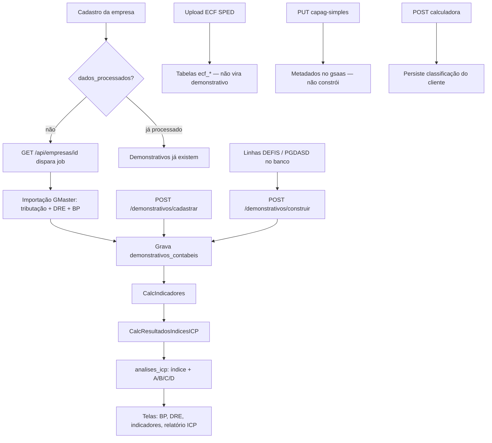

# Manual técnico do processo CAPAG

Documento de referência do backend **CapagWebAPI**: regras de negócio, decisões técnicas e o fluxo completo desde o cadastro da empresa até a classificação de capacidade de pagamento (ICP / CAPAG).

Complementa, sem substituir:

- [Integração frontend — Balanço](integracao-frontend-balanco.md)
- [Integração frontend — Indicadores](integracao-frontend-indicadores.md)
- [Capag Simples Nacional — contrato de API](capag-simples-nacional.md)

A fonte de verdade das regras é o código. Fórmulas de indicadores e ICP estão em JSON versionado (`Domain/Resources/`). Pesos, metas e pior caso do ICP estão na tabela `modelos_indices_icp`.

---

## 1. O que a CAPAG calcula

A CAPAG (capacidade de pagamento) combina três camadas:

| Camada | O que é | Como nasce |
|--------|---------|------------|
| **Demonstrativos** | Plano de contas ECD (ativo, passivo, PL, DRE) por exercício | Importação GMaster, construção DEFIS/PGDASD, ou cadastro manual |
| **Indicadores** | 17 índices financeiros **por exercício**, com média (`saude_empresa`) | Motor `CalcIndicadoresHandler` + `Indicadores.json` |
| **ICP** | Um índice único 0–100 e classificação **A / B / C / D** | Motor `CalcResultadosIndicesICPHandler` + `ModelosIndicesICp.json` + pesos no banco |

Há ainda:

- **Calculadora CAPAG** (`capag-e-1`, `capag-e-2`, `capag-p`): persistência do resultado já classificado pelo cliente (não recalcula no backend).
- **Simulação** e **variáveis por tipo de grupo**: insumos fiscais (DARF, DIRF, DCTF, PGDASD, IRPF, débitos) para cenários.
- **Declaração Simples Nacional** e **valores manuais** de DRE/Balanço: metadados persistidos no `gsaas` para o client-app. **Não** disparam `/construir` nem o recálculo.

---

## 2. Arquitetura

### 2.1 Camadas

```
WebAPI (controllers, JWT, tenant, swagger)
    → Application (MediatR CQRS, validators FluentValidation, handlers, helpers)
        → Domain (entidades, contratos, enums, fórmulas JSON, CalculosServices)
            → Infrastructure (EF Core MySQL, storage local, jobs, parsers SPED)
```

Decisões:

| Decisão | Escolha |
|---------|---------|
| Estilo | Clean Architecture + CQRS via MediatR |
| Persistência | EF Core + MySQL (`gsaas`), views SQL para BP/DRE |
| Validação | Pipeline `ValidationBehavior` + FluentValidation |
| Mapeamento | AutoMapper (`MappingProfile`) |
| Fórmulas | JSON em `Domain/Resources`, avaliadas com NCalc |
| Horário | `DateTimeHelper.GetDateTimeNow()` = UTC − 3 (fixo, não IANA) |
| Soft delete | `deleted_at` em demonstrativos, indicadores, análises ICP, empresa |
| Paginação | Padrão `page_size = 10`; BP eleva para 500 quando `IdEmpresa` vem com o padrão |

### 2.2 Multi-tenant

Toda entidade `ITenantEntity` recebe:

1. **Query filter global** em `CPGDbContext`: só enxerga `id_tenant == TenantId` do request.
2. **SaveChanges**: `Added` preenche `IdTenant` do header; `Modified`/`Deleted` recusa outro tenant (`TenantAccessException`).
3. **Header obrigatório** `X-Tenant-Id` nas rotas autenticadas (`TenantPermissionMiddleware`).
4. Vínculo `usuario_tenant` ativo (`Ativo` e `DeletedAt == null`); senão HTTP 403.

O JWT carrega só o `IdUsuario`. Papel e tenant **não** vão no token: o `TenantPermissionMiddleware` resolve o vínculo `usuario_tenant` a cada request e injeta `ClaimTypes.Role`.

O `[Authorize(Roles = "Admin,editor")]` casa exatamente com a string `Admin`. Se o banco gravar `administrador` (ENUM comentado em alguns maps) ou `proprietario`, a role ASP.NET **não autoriza** escrita.

O filtro global **só** cobre quem implementa `ITenantEntity`. Ficam **fora** do filtro (isolamento no handler, quando existe):

| Sem `ITenantEntity` | Efeito |
|---------------------|--------|
| `DemonstrativoContabil`, `RegimeTributario`, `ResultadosPeriodo` | Têm `id_tenant`, mas a query não filtra sozinha |
| Views BP/DRE/dashboard | `GetAllBPViewHandler` filtra `IdEmpresa`/`Ano`, não tenant |
| `Operation` / tabelas `ecf_*` | Linhas ECF não gravam tenant; amarra via `id_op` |
| `ValorAnual`, `ModeloIndiceICP` | Filho de indicador / cadastro de fórmula |
| `Usuario`, `Tenant`, `AuditLog` | Identidade e auditoria globais |

Jobs em background chamam `currentUser.SetTenantId(...)` porque não há HTTP context.

### 2.3 Autenticação e autorização

- JWT Bearer (`Issuer`/`Audience`/`Key`); `ClockSkew = 0`; `RequireHttpsMetadata = false`.
- Mutações de empresa, demonstrativos e Simples exigem papel **`Admin` ou `editor`**.
- Leitura autenticada: qualquer papel com vínculo ao tenant.
- CORS: origem `http://localhost:3000` com credenciais.
- Upload: até **2 GB** (Kestrel + multipart).
- Senha: SHA-256 Base64 **sem salt**.
- Erros de domínio: `ExceptionMiddleware` serializa `AppException` em `{ error: { status_code, code, message, errors } }`. `TenantAccessException` hoje cai em 500 genérico.
- `POST /api/usuarios` é `[AllowAnonymous]` (auto-cadastro). CRUD de tenants/usuários autenticado **sem** role Admin.

### 2.4 Isolamento de dados

`id_empresa` da tabela `empresas` (Capag / `gsaas`) **não** é o `company_id` do gmsystem. Integrações externas devem mapear CNPJ → `id_empresa`. Unique da calculadora é `(id_empresa, modelo)` **sem** tenant.

---

## 3. Processo completo



Três **pipelines de demonstrativo** (mutuamente usados conforme o regime):

| Pipeline | Quando | Entrada | Handler |
|----------|--------|---------|---------|
| **GMaster** | Primeiro `GET` da empresa com `dados_processados = false`, ou `POST .../reprocessar` | API GMaster (`/tributacao`, `/dre`, `/balanco`) | `CreateDemonstrativoContabilHandler` |
| **Construir Simples** | Empresa optante, com DEFIS + PGDASD no `gsaas` | `reg_defis` + `reg_pgdasd` | `ConstruirDemonstrativosHandler` |
| **Cadastrar** | Carga explícita de contas (planilha / outro sistema) | JSON de contas | `CadastrarDemonstrativosContabeisHandler` |

Os três, ao concluir com sucesso, disparam **sempre** o recálculo de indicadores e ICP e marcam `empresa.dados_processados = true`.

Há **três caminhos de dado que não se cruzam**:

| Caminho | Origem | Destino | Alimenta indicadores/ICP? |
|---------|--------|---------|---------------------------|
| ECF arquivo | `POST /api/ECF/upload` | Disco + `ecf_*` | Não |
| Registros fiscais | JSON no cliente (DEFIS, PGDASD, …) | `reg_filename` + `reg_*` | Só via `/construir` (DEFIS+PGDASD) |
| GMaster | API externa | `demonstrativos_contabeis` | Sim |

Não existe parser ECD nesta API. “ECD” no código é convenção (`A00`, indicador D/C).

---

## 4. Cadastro de empresa

Entidade `Empresa`: CNPJ (value object), razão social, matriz/filial, CNAE, município/estado, capital social, segmento, porte, `dados_processados`, `data_impedimento`, `id_usuario_responsavel`.

Regras:

- CNPJ único no tenant (conflito `EmpresaCnpjConflictException`).
- CNPJ validado por dígitos (`Cnpj.TentarCriar`).
- `MATRIZ` ou `FILIAL`. Filial deveria exigir `id_empresa_matriz`; o validador compara a string `"filia"` (sem L) — filiais com o valor `"FILIAL"` **não** disparam essa regra hoje.
- Data de abertura não pode ser futura.
- Soft delete (`deleted_at`). **Listagem e GET all não filtram** `deleted_at` — empresa apagada ainda aparece.
- Impedimento: `PUT /api/empresas/{id}/impedimento` grava data e responsável; não bloqueia cálculo no backend.

### 4.1 Processamento automático no GET

`GET /api/empresas/{id}`:

1. Se `dados_processados == true`, só devolve o DTO.
2. Se `false` **e** não existe `process_log` com ação `"Processamento iniciado"`, enfileira job em background:
   - `CreateDemonstrativoContabilCommand` (GMaster)
   - marca `dados_processados = true`
   - log `"Processamento terminado"` ou `"Erro ao processar Empresa"`

O GET **não espera** o job. A UI deve consultar `process_log` / `dados_processados`.

Esse gatilho é **sempre GMaster**, inclusive para empresa do Simples: se `dados_processados` ainda é `false`, o primeiro GET tenta ECD via API externa e pode falhar quando não houver escrituração. O caminho Simples correto é `POST /demonstrativos/construir` depois de haver linhas DEFIS/PGDASD.

---

## 5. Fontes de dados

### 5.1 Importação GMaster (Lucro Real / Presumido / ECF já consolidado)

`IntegracaoDemonstrativosService` chama `ApiGmaster:BaseUrl`:

| Recurso | URL | Uso |
|---------|-----|-----|
| Tributação | `/tributacao?cnpj=` | Define os anos da janela de importação |
| DRE | `/dre?ano=a,b,c&cnpj=` | Contas `3.*`, só `val_cta_ref_fin` |
| Balanço | `/balanco?ano=a,b,c&cnpj=` | Contas patrimoniais com ini/deb/cred/fin |

Anos importados (`DemonstrativosAnosHelper.ObterAnosImportacaoComAnterior`):

1. Os **3 anos mais recentes** presentes na tributação (sem inventar anos faltantes).
2. Mais o **ano imediatamente anterior** ao mais antigo desses 3, **se** também existir na tributação — só para alimentar `{codigo}[I]` (saldo inicial).

Exemplo: tributação 2019, 2021, 2022, 2023 → janela de cálculo 2021–2023; importação 2020–2023 se 2020 existir, senão 2021–2023.

Falha em tributação, DRE ou balanço aborta tudo (transação local do `DbContext`): nenhum demonstrativo parcial.

### 5.2 Construção Simples Nacional (DEFIS + PGDASD)

Ver seção 7. Independente do GMaster.

### 5.3 Cadastro manual de contas

`POST /api/demonstrativos/cadastrar`:

- Todas as contas da mesma `id_empresa`.
- Obrigatórios: `codigo`, `per_apur`, `ano`, `tipo_trib`, `tipo`.
- `sobrescrever = true`: soft-delete das contas existentes com a mesma chave `(ano, per_apur, tipo_trib)`.
- Descarta linha se **ini e fin** são nulos ou zero.
- Balanço (`codigo` não começa com `3`) sem `val_cta_ref_ini`: preenche com o **fechamento do ano N−1** (payload primeiro, banco depois). Prioridade do fechamento: `A00` > `T04` > maior `per_apur`. Sem N−1 → abertura `0`.
- DRE não recebe esse enriquecimento de abertura.

### 5.4 SPED ECF (upload)

Não há parser ECD. O único arquivo SPED processado é **ECF**.

`UploadECFHandler`:

1. Cria `Operation` (`Criada` → `AguardandoProcessamento` ou `AguardandoProcessamentoComSobrescrita`). Nome interno: `"Importaçaõ de ecf"`.
2. Lê a linha `|0000|` para competência (`yyyyMM`) e raiz do CNPJ — **não persiste** esses campos.
3. Grava arquivo em `Storage:BasePath/{idOp}/{Guid}_{fileName}` (não no desenho antigo `cnpj/competencia`).
4. Dispara `EcfBackgroundWorker` (um job por vez; `Trigger` concorrente pode ser perdido).

Parser: streaming ISO-8859-1, channel 40 000, bulk MySQL. `layoutNumber` **fixo = 10** (não lê `COD_VER`). `Overwrite` muda o status da operação mas **não apaga** `ecf_*` anteriores. Bulk está fora da transação da operação: arquivo pode ficar `Processado` com insert parcial.

O repositório de layout **carrega de fato** `0000`, `0001`, `0010`, `L001`, `L030`, `L100` (balanço). JSON de `L300` (DRE) e bloco P existem, mas o cache **não os inclui**.

A ECF **não** vira demonstrativo. Indicadores usam GMaster, `/construir` ou `/cadastrar`.

`DocumentLayout` / `ExtractionRule` são CRUD de regex para o cliente (PDFs fiscais). O parser ECF **não os usa**.

Máquina de estados: `Criada` → `Aguardando*` → `EmProcessamento` → `Processada` | `ProcessadaComErro`. Reprocesso: `Processada` / erro / `Cancelada` → `Reprocessando`. `Cancelada`/`Recebido` existem no enum e não são usados. Reprocessamento marca `Finish()` mesmo após exceção.

### 5.5 POST de registros fiscais (DEFIS, PGDASD, …)

Os Create handlers atuais mapeiam o body para **um** `RegFileName` e **não** inserem as linhas (`RegDefi`, `RegPgdasd`, etc. — o `AddRange` está comentado). O `/construir` lê as tabelas `reg_*`. Sem outro processo gravando as linhas (SQL direto, job legado, outro serviço), a construção Simples fica sem receita/estoque/despesas.

DCTF é o único com regra de retificadora: `ReciboRetificadora` no primeiro item apaga DCTF do mesmo período; senão, duplicata recusa. DARF exige `ValorTotal > 0` e data de arrecadação não futura.

---

## 6. Regras contábeis transversais

### 6.1 Dois saldos (layout ECD)

| Campo | Significado |
|-------|-------------|
| `val_cta_ref_ini` + `ind_val_cta_ref_ini` | Abertura (01/01) |
| `val_cta_ref_fin` + `ind_val_cta_ref_fin` | Fechamento (31/12) ou fluxo do período (DRE) |

Indicador ECD: **`D` = débito**, **`C` = crédito**. Armazenamento: valor sempre **magnitude positiva** + indicador.

### 6.2 Sinal: armazenamento vs fórmulas

`SaldoContabilHelper`:

- `SaldoAssinado` / `ValorParaFormula`: **crédito (azul na tela) → positivo**, **débito → negativo**, inclusive no Ativo. O D/C do balanço já chega invertido em relação à DRE; inverter de novo deixava `1.01.01` negativo na liquidez. Exceção: `3.01.01` e `3.01.01.*` em magnitude.
- `Magnitude`: também no **PMP** (Giro/PME/Ciclo) e na **Cobertura de Juros (ICP)**.

ROE com PL (`2.03`) ≤ 0 não calcula a razão — grava `alerta`/`mensagem` = `"Não Analisar: Informação Comprometida"` e `valor` nulo. Os demais indicadores usam o PL negativo na fórmula.

### 6.3 Balanço vs DRE

| | Balanço (códigos `1.*` e `2.*`) | DRE (código começa com `3`) |
|--|--------------------------------|-----------------------------|
| Natureza | Posição (estoque) | Fluxo do período |
| `val_cta_ref_ini` | Obrigatório (0 se não houver) | Sempre `null` |
| Consolidação anual trimestral | Usar **T04** (não somar T01…T04) | **Somar** trimestres via `ValorParaFormula` |
| Consolidação anual `A00` | `ValorParaFormula` de `val_cta_ref_fin` | `ValorParaFormula` de `val_cta_ref_fin` |
| `{codigo}[I]` | Trimestral: T04 (ou A00) do **ano anterior**; anual: `val_cta_ref_ini` do A00 | Não se aplica |

Identificação de DRE no consolidator: **todas** as linhas do grupo `(codigo, ano)` têm `val_cta_ref_ini == null`.

### 6.4 Período de apuração

- `A00` = exercício anual.
- `T01`…`T04` = trimestres. Fechamento do ano = `T04`.
- Construção Simples **sempre** grava `A00`.

### 6.5 Fonte única de consolidação anual

`GetDClByAnoAndCodigoHandler` com `Ano = true` (sem `SomarPeriodosNoAno`) é a fonte única usada por indicadores e ICP.

Comportamento extra: se a janela de cálculo inclui o ano `N−1` e **não há lançamentos** nesse ano, o handler **sintetiza** o BP do ano mais antigo da janela a partir da **abertura** do primeiro exercício com dados (`T01` ini ou `A00` ini). DRE **não** é sintetizada (abertura patrimonial não é resultado do período).

`SomarPeriodosNoAno = true` soma `val_cta_ref_fin`/`ini` crus (com sinal do banco). **Não** é o caminho dos indicadores.

Códigos inexistentes na fórmula viram **0** (`ExpressionHelper.SubstituirCodigos`). Divisão por zero, NaN e Infinity viram **0**.

---

## 7. Construção Simples Nacional (`POST /api/demonstrativos/construir`)

Pré-condições: `id_empresa` e lista de `anos`; `id_tenant` do body é **ignorado** — vale o header. Mutação: `Admin`/`editor`.

Por ano, em transação:

1. Se `sobrescrever`: soft-delete dos demonstrativos daquele ano.
2. Lê DEFIS (`periodo.Year == ano`) e PGDASD (string `YYYY-MM` / `YYYY-MM-DD`).
3. Alertas (não abortam):
   - `DESPESAS_ZERADAS`
   - `DIVERGENCIA_RECEITA` se \|DEFIS − Σ PGDASD\| > R$ 1,00 e ambos > 0
   - `CMV_DIVERGENTE` / `CMV_NEGATIVO` / `CMV_ZERADO`
4. Monta contas analíticas/sintéticas (abaixo).
5. PL do ano N vira abertura do ano N+1 (encadeamento na mesma chamada, anos ordenados).

Ao final de **todos** os anos: calcula indicadores, calcula ICP, `dados_processados = true`.

### 7.1 Mapeamento DEFIS → contas

Busca por `descricao.Contains(chave)` (case-insensitive); soma se houver várias linhas.

| Chaves DEFIS (exemplos) | Conta | Ini | Fin | Ind |
|-------------------------|-------|-----|-----|-----|
| Saldo caixa/banco início / final | `1.01.01` Disponibilidades | início | final | D |
| Estoque inicial / final | `1.01.03` Estoques | inicial | final | D |
| Fornecedores | `2.01.01.03` | — | valor | D |
| Despesas + desp. financeiras + dívidas bancos | `2.01.01.07` Outros passivos circ. | — | soma | D |
| CMV (se declarado) | `3.01.01.03` / `3.01.01.03.01` | — | ver 7.3 | D |

### 7.2 Mapeamento PGDASD → contas

| Campo | Conta | Uso |
|-------|-------|-----|
| Σ `ReceitaBruta` do ano | `3.01.01.01.01` Receita bruta | DRE (C) |
| Σ `TotalDebito` (DAS) | `2.01.01.09.28` Tributos a recolher (DAS) | Passivo (D); também entra nas deduções da DRE |

### 7.3 Identidades da DRE (Simples)

```
Deduções        = DAS + devoluções de vendas
Receita líquida = max(0, Receita bruta − Deduções)
CMV             = ver regra abaixo
Lucro bruto     = Receita líquida − CMV
Lucro líquido   = Lucro bruto − despesas do período   (resultado operacional = mesmo valor)
```

**CMV**

1. Se DEFIS declara CMV > 0 → usa DEFIS. Se o CMV por estoque também > 0 e \|diferença\| > 1 → alerta, **mantém DEFIS**.
2. Senão: `EstoqueIni + Compras − Dev.Compras − EstoqueFin`.
3. Se o CMV por estoque < 0 → grava **0** e alerta.
4. Se CMV = 0 com receita líquida > 0 → alerta.

Lucro bruto / operacional / líquido negativos são gravados como magnitude + indicador `D`; positivos + `C`.

Contas de receitas operacionais/financeiras, depreciação e despesas financeiras **na DRE do Simples** são placeholders **zerados**. As despesas financeiras da DEFIS entram no **passivo** (`2.01.01.07`), não na DRE `3.01.01.09.*`.

### 7.4 Identidades do Balanço (Simples)

Decisão central: **PL = Ativo − Passivo**. O resultado da DRE **não** é usado como plug do PL.

```
Ativo circulante ini/fin = Caixa + Estoque
Ativo                    = Ativo circulante          (ANC 1.02 = 0)
Outros passivos circ.    = Despesas + Desp. financeiras + Dívidas bancos
Passivo circulante       = Fornecedores + Outros passivos + DAS
Passivo não circulante   = 0
Passivo                  = Passivo circulante
PL final                 = Ativo final − Passivo circulante
PL inicial               = PL final do ano anterior (0 se não houver)
```

PL negativo (passivo > ativo) é gravado com indicador `D`.

Placeholders zerados para fórmulas que exigem contas inexistentes no Simples: `1.01.02.02` (duplicatas), `2.01.01.09.09` / `.10` (tributos fed/est), `2.01.01.17.13` (outras obrigações). Sem isso, NCG/PMR receberiam 0 de qualquer forma; a linha existe para a árvore e o consolidator.

`tipo_trib` gravado: `"Simples Nacional"`. `tipo` sintético `S` ou analítico `P` (DAS). Nível = quantidade de segmentos do código.

---

## 8. Janela de anos (indicadores e ICP)

Constante: `DemonstrativosAnosHelper.QuantidadeAnosCalculo = 3`.

`ObterJanelaUltimosAnos`: **três exercícios contíguos terminando no maior ano cadastrado**, mesmo que o meio/início não tenham demonstrativo.

```
anos gravados = {2021, 2022}  →  janela = 2020, 2021, 2022
```

2020 entra com valor **0** nos indicadores (e na média `saude_empresa`), salvo se o consolidator sintetizar o BP pela abertura de 2021.

Isso é **diferente** da régua do Balanço na UI (que pode mostrar abertura como coluna extra) e **diferente** da importação GMaster (`ObterAnosMaisRecentes` não inventa anos).

`GET /api/demonstrativos/anos-disponiveis` lista união de anos DEFIS + PGDASD + demonstrativos, com contagens — é o seletor do `/construir`, não a janela de cálculo.

`GetAnosCalculoDemonstrativoHandler` (janela de indicadores/ICP) **não filtra** `deleted_at`: anos só em demonstrativos soft-deleted ainda entram no Max e na janela.

---

## 9. Indicadores financeiros

Disparados após qualquer pipeline de demonstrativo. Recálculo **apaga** indicadores anteriores da empresa (soft delete + delete físico de `valores_anuais`) e reinsere. Constraint `uk_indicadores_ativo` (`id_tenant`, `id_empresa`, `nome`, coluna gerada `ativo_unico`) garante um ativo por nome.

Arredondamento no motor: **6 casas**. Persistência `valores_anuais.valor` é `DECIMAL(10,2)` — o banco corta ao gravar. `saude_empresa` = média aritmética dos valores da janela, **incluindo zeros**.

### 9.1 Catálogo (`Indicadores.json`)

| Indicador | Grupo | Fórmula (códigos) |
|-----------|-------|-------------------|
| Liquidez Geral | Liquidez | `{1.01} / {2.01}` |
| Liquidez Seca | Liquidez | `({1.01} - {1.01.03}) / {2.01}` |
| Liquidez Imediata | Liquidez | `{1.01.01} / {2.01}` |
| Capital de Giro de Longo Prazo (CGLP) | Liquidez | `(({2.02} + {2.03}) - {1.02}) / {1}` |
| Índice de Endividamento Geral | Endividamento | `({2.01} + {2.02}) / {1}` |
| Grau de Endividamento | Endividamento | `({2.01} + {2.02}) / {2.03}` |
| Composição do Endividamento | Endividamento | `{2.01} / ({2.01} + {2.02})` |
| Margem Operacional | Rentabilidade | `{3.01.01} / {3.01.01.01}` |
| Margem Líquida | Rentabilidade | `{3} / {3.01.01.01}` |
| ROA | Rentabilidade | `{3} / {1}` |
| ROE | Rentabilidade | `{3} / {2.03}` |
| Giro do Estoque | Ciclo | `{3.01.01.03} / (({1.01.03[I]} + {1.01.03}) / 2)` |
| PMP | Ciclo | `((({2.01.01.03[I]} + {2.01.01.03}) / 2) * 365) / ({1.01.03} + {3.01.01.03} - {1.01.03[I]})` |
| PME | Ciclo | `({3.01.01.03} / (({1.01.03[I]} + {1.01.03}) / 2)) / 365` |
| PMR | Ciclo | `((({1.01.02.02[I]} + {1.01.02.02}) / 2) * 365) / {3.01.01.01.01}` |
| Ciclo Financeiro | Ciclo | PME + PMR − PMP (fórmula expandida no JSON) |
| NCG | Ciclo | `(({1.01} - {1.01.01}) - ({2.01} - {2.01.01.07} - {2.01.01.09.09} - {2.01.01.09.10} - {2.01.01.17.13})) / {3.01.01.01}` |

`{codigo}` = magnitude do fechamento do exercício. `{codigo}[I]` = magnitude da abertura.

Descrições de negócio e grupos: `IndicadorDescricaoMapper` / `IndicadorGrupoMapper`. CGLP está no grupo Liquidez; se o nome não mapear → `"Não Classificado"`.

### 9.2 Leitura para a UI

`GET /api/Indicadores/calculos_indicaroes/{idEmpresa}` (grafia histórica). `PageSize` padrão 10 — usar **50**. `ano` no DTO é **string**. Ordenar anos no cliente. Ver [integracao-frontend-indicadores.md](integracao-frontend-indicadores.md).

`GET /api/Indicadores` enriquece grupo/fórmula; filtro `Grupo` aplica-se **depois** da página SQL (pode reduzir itens da página).

Há um `IndicadoresTesteController` legado, sem `[Authorize]`, que grava com `IdTenant = 1`. **Não faz parte do processo oficial.**

---

## 10. ICP (Índice de Capacidade de Pagamento)

### 10.1 Diferença crítica em relação aos indicadores

Indicadores: fórmula **por ano**, depois média.

ICP: **soma as magnitudes de cada código ao longo da janela de 3 anos** e aplica a fórmula **uma vez**.

```
LC = Σ(1.01 nos 3 anos) / Σ(2.01 nos 3 anos)
```

Não é a média das LCs anuais.

### 10.2 Modelos (`ModelosIndicesICp.json`)

A fórmula só é calculada se existir linha em `modelos_indices_icp` com o **mesmo nome** (trim, case-insensitive). Sem match → ignorada. O handler **não filtra** `Ativo`. A coluna `formula` do banco é ignorada; vale o JSON. Nenhuma fórmula ICP usa `[I]`.

| Nome | Fórmula |
|------|---------|
| Liquidez Corrente (LC) | `{1.01} / {2.01}` |
| Liquidez Seca (LS) | `({1.01} - {1.01.03}) / {2.01}` |
| Margem Líquida (ML) | `{3} / {3.01.01.01}` |
| Cobertura de Juros (CJ) | EBIT / despesas financeiras líquidas (vários códigos `3.01.01.09.01.*` menos receitas financeiras) |
| Endividamento Geral (EG) | `({2.01} + {2.02}) / {1}` |

No Simples, várias contas de CJ são 0 → CJ tende a 0 (subscore no pior caso, conforme meta/pior caso do modelo).

### 10.3 Subscore, índice e classificação

`CalculosServices`:

```
bruto    = (valorCalculado − piorCaso) / (meta − piorCaso)
subscore = clamp(bruto, 0, 1) × 100
índice   = Σ (subscore × peso)
```

- `meta` e `pior_caso` vêm do cadastro do modelo (não do JSON).
- Se `meta == piorCaso` → subscore 0.
- `SomaPesos` gravada na análise é **constante 100** (não é a soma dos pesos das linhas).
- Para o índice cair na faixa 0–100 das classificações abaixo, os **pesos no banco devem ser frações que somam 1** (ex.: 0,20). Se estiverem em percentual (20), o índice infla e a classificação distorce.

Classificação do índice total:

| Condição | Classe |
|----------|--------|
| ≤ 45 | **D** |
| ≤ 75 | **C** |
| ≤ 90 | **B** |
| > 90 | **A** |

Recálculo apaga `resultados_indices_icp` (físico) e soft-delete de `analises_icp`.

`ICPLimit` (faixas coloridas por tenant: label, min, max, cor) e `ICPsAnterior` (classificação/valor de receita informados) são **cadastros auxiliares de UI/histórico**; o motor **não** os lê. Classificação A–D está **hardcoded** (45 / 75 / 90). `IndicadoresLiquidez` e `ResultadosPeriodo` existem no domínio e **não** entram neste fluxo.

Relatório: `GET /api/AnalisesICP/relatorio` (CNPJ, razão, classe, ICP formatado pt-BR com 4 casas).

---

## 11. Calculadora CAPAG (persistência)

Não calcula. O frontend envia o resultado já classificado.

Modelos permitidos: `capag-e-1`, `capag-e-2`, `capag-p`.  
Classificação: `A`, `B`, `C`, `D` (normalizada em maiúsculas).

Unicidade: um registro por `(id_empresa, modelo)` — conflito `CapagCalculadoraResultadoConflictException`.

Campos: `percentual_exibicao`, `label_metrica`, `status_mensagem`, `valor_capag`, `valor_divida`, `indice`, `parcial`, `id_usuario` do token.

`sp_clear_empresa_full` apaga esses registros; `sp_clear_empresa_recalc` **preserva**.

---

## 12. Declaração Simples Nacional e valores manuais

Contrato camelCase (exceção na API). Paths e exemplos: [capag-simples-nacional.md](capag-simples-nacional.md).

### Declaração

- Uma por `id_empresa`.
- `SIMPLES_EXERCISE_YEARS`: exige ≥ 1 ano com `1900 < ano < 2100`; duplicatas removidas e ordenadas.
- `NO_NATIONAL_SIMPLE_STRICT`: anos ignorados (lista vazia).
- PUT substitui os exercícios. DELETE é idempotente.

### Valores manuais DRE / BALANCE_SHEET

- PUT é **replace do kind inteiro**. `porCodigo` vazio limpa o kind.
- Não alimenta `demonstrativos_contabeis` sozinho; o `/construir` lê DEFIS/PGDASD. Os manuais são persistência para o client-app / gmaster-system.

Códigos de registro (`codigos_registro_descricao`): par `codigo` + `expressao_regular` + `is_valid` por empresa — cadastro auxiliar para matching de descrições DEFIS; o `/construir` atual **não** consulta essa tabela (usa chaves hardcoded).

---

## 13. Simulação e variáveis fiscais

### 13.1 Simulação

Não há motor de simulação no backend — só persistência para o cliente.

`SimulacaoCalc`: `tipo_simulacao` (`PREVIDENCIARIO` | `OUTRO`), `limitador_pct`, `desc_max_pct`, flags de prejuízo/abatimento e valores. Sem FluentValidation.

`SimulacaoIntervalo`: `tipo_intervalo` (`ENTRADA` | `PRESTACAO`), `mes_ini`–`mes_fim`, `pct_mensal`. **Única regra:** no máximo um intervalo `ENTRADA` por simulação (`DuplicateIntervalException`). `PRESTACAO` pode repetir. Não valida 1–12 nem `mes_ini <= mes_fim`. Update não revalida duplicidade de ENTRADA.

CRUD autenticado; não entra no recálculo de indicadores/ICP.

### 13.2 Tipo de grupo e estratégias

`TipoGrupo.Tag` escolhe a strategy em `CalculoGrupoFactory`:

| Tag | Strategy | Origem dos valores |
|-----|----------|--------------------|
| `pj_ativa_optante_simples` | `PjOptanteCalculoStrategy` | PGDASD (`ReceitaBruta` com `Periodo.ToString() == ano` — **não casa** `yyyy-MM` com `yyyy`; receita tende a 0), DARF (total no ano da arrecadação), DIRF (rendimentos `1708,3280,5944,8045`; tributo total; notas `3249,3251,3426,5232,5273,5557,6800,6813,8468`) |
| `pj_ativa_nao_optante` | `PjNOptanteCalculoStrategy` | DARF, DIRF (mesmos códigos de rendimento), DCTF (`Periodo` começa com o ano), DRE `3.01.01.01.01` (A00 se houver, senão soma T*) |
| `pessoa_fisica` | `PfCalculoStrategy` | Primeiro `RegIrpf` do ano (`ValorV1`–`V4`, `V6`, `V7`); 404 se não houver |

`ValorCalcVariavel`: `id_variavel`, `ano_base` (1900–2100), `id_tipo_grupo`, `valor` ≥ 0, `status`. Validador aceita `ignorado` ou `preenchido`; ENUM do banco é `preenchido` / `calculado`.

`DescricaoDebito`: CDA (natureza, principal, multa, juros, encargos) — insumo de simulação, não do ICP.

---

## 14. Reprocessamento e limpeza

| Ação | Procedure / fluxo | Apaga | Preserva |
|------|-------------------|-------|----------|
| `POST /api/empresas/{id}/reprocessar` | `sp_clear_empresa_recalc` + job GMaster | Demonstrativos, indicadores, valores anuais, ICP, regimes, resultados_periodo, process_log; zera `dados_processados` | Cadastro, simulação, ICP anterior, débitos, regs fiscais, ECF, Simples, calculadora |
| Wipe operacional | `sp_clear_empresa_full` | Recalc + simulação + ICP anterior + débitos + Simples + códigos registro + calculadora | Cadastro, regs fiscais, ECF |

Reprocessar devolve **202 Accepted**. Preferível sem job em andamento para a mesma empresa.

---

## 15. Convenções de API

| Tema | Convenção |
|------|-----------|
| URLs | `lowercase` |
| JSON da API “clássica” | snake_case (`[JsonPropertyName]`) |
| Capag Simples | camelCase |
| `valoresAnuais` | camelCase (sem atributo) |
| Auth | `Authorization: Bearer` + `X-Tenant-Id` |
| Paginação | `Page`, `PageSize` (default 10) |
| Soft delete | Leituras filtram `deleted_at IS NULL` (exceto janela de anos de cálculo, que hoje **não** filtra deletados ao listar anos) |

Views:

- `vw_balanco_patrimonial` — linhas com `val_cta_ref_ini IS NOT NULL`.
- `vw_dre` — DRE.
- `GET /api/Views/balanco-patrimonial` eleva `PageSize` 10 → 500 se houver `IdEmpresa`.

---

## 16. Catálogo de decisões técnicas

1. **Três pipelines de demonstrativo**, um recálculo comum (indicadores → ICP).
2. **Fórmulas em JSON**, parâmetros de scoring ICP no banco (meta, pior caso, peso).
3. **Sinais nas fórmulas**: crédito (azul) → + e débito → − em todas as contas (Ativo incluso); `3.01.01*` e PMP/CJ usam Magnitude. ROE com PL ≤ 0 → `Não Analisar: Informação Comprometida`.
4. **PL do Simples = Ativo − Passivo**, nunca plug da DRE.
5. **CMV: DEFIS tem prioridade** sobre estoque; CMV negativo vira 0.
6. **Janela de 3 anos contíguos até o Max**, inventando anos zerados — média inclui zero.
7. **ICP soma os três anos antes da fórmula**; indicadores não.
8. **`[I]` = fechamento do exercício anterior** (T04/A00), fora do filtro da janela quando necessário.
9. **Divisão por zero / conta ausente = 0**, nunca erro HTTP no cálculo.
10. **Soft delete + unique parcial** em indicadores ativos (migração `20260721`).
11. **Tenant no header é fonte de verdade** (`/construir` sobrescreve `id_tenant` do body).
12. **Processamento GMaster é assíncrono** no primeiro GET.
13. **Calculadora não recalcula** — contrato de persistência.
14. **Horário de negócio UTC−3** fixo.
15. **Placeholders zerados** no Simples para o plano de contas das fórmulas não quebrar a árvore.
16. **Alertas do `/construir` não abortam** o ano; só `Erros` (exception) marcam `sucesso = false`.
17. **Receita Simples vem do PGDASD** (somatório); DEFIS só confere divergência.
18. **PME no JSON é (giro)/365**, não 365/giro — a implementação segue o arquivo, não a definição clássica em dias.
19. **ECF não alimenta demonstrativos**; layout efetivo é só até L100.
20. **POST fiscal atual grava só `reg_filename`**, não as linhas `reg_*`.
21. **GET empresa sempre dispara GMaster** se ainda não processada — não distingue Simples.
22. **Classificação ICP hardcoded**; `icp_limits` é só UI.
23. **Simulação e calculadora são persistência**, não motor.

---

## 17. Comportamento atual a ter em conta

Itens que o processo oficial assume, mas o código de hoje trata assim:

- Matching DEFIS por **substring** em `Descricao` (várias linhas somam; textos parecidos misturam).
- Despesas financeiras do Simples vão ao **passivo**, não à DRE `3.01.01.09.*` → Cobertura de Juros do ICP fica 0.
- Placeholders `1.01.02.02` etc. zerados → PMR/ciclo/NCG no Simples saem distorcidos ou 0.
- `peso` em `DECIMAL(5,4)`: gravar `20` em vez de `0,20` satura `icp_calculado`.
- Delete de `OperationFile` não apaga o arquivo em disco.
- `IndicadoresTesteController` sem autenticação — fora do processo.

---

## 18. Mapa de endpoints do processo

| Etapa | Método e rota | Papel |
|-------|---------------|-------|
| Empresa CRUD | `/api/empresas` | escrita: Admin/editor |
| Disparo GMaster | `GET /api/empresas/{id}` | autenticado |
| Reprocessar | `POST /api/empresas/{id}/reprocessar` | Admin/editor |
| Consolidados (fórmulas) | `GET /api/empresas/demonstrativos-contabeis?idEmpresa=&ano=true` | autenticado |
| Construir Simples | `POST /api/demonstrativos/construir` | Admin/editor |
| Cadastrar contas | `POST /api/demonstrativos/cadastrar` | Admin/editor |
| Anos DEFIS/PGDASD | `GET /api/demonstrativos/anos-disponiveis` | autenticado |
| Plano de contas | `GET /api/demonstrativos/contas` | autenticado |
| Balanço UI | `GET /api/Views/balanco-patrimonial` | autenticado |
| DRE UI | views DRE | autenticado |
| Indicadores grade | `GET /api/Indicadores/calculos_indicaroes/{id}` | autenticado |
| ICP | `GET /api/AnalisesICP`, `/relatorio` | autenticado |
| Calculadora | `/api/CapagCalculadoraResultado` | autenticado |
| Simples | `/api/empresas/{id}/capag-simples/*` | escrita: Admin/editor |
| ECF | controllers SPED/ECF | autenticado |
| Tipo grupo / variáveis | `/api/TipoGrupo`, `/api/ValorCalcVariavel` | autenticado |

---

## 19. Referências de código

| Responsabilidade | Arquivo |
|------------------|---------|
| Construção DEFIS/PGDASD | `Application/Handlers/DemonstrativosContabeis/ConstruirDemonstrativosHandler.cs` |
| Importação GMaster | `Application/Handlers/DemonstrativosContabeis/CreateDemonstrativoContabilHandler.cs`, `Application/IntegracaoDemonstrativosService.cs` |
| Cadastro manual | `Application/Handlers/DemonstrativosContabeis/CadastrarDemonstrativosContabeisHandler.cs` |
| Consolidação anual | `Application/Handlers/DemonstrativosContabeis/GetDClByAnoAndCodigoHandler.cs` |
| Janela de anos | `Application/Helpers/DemonstrativosAnosHelper.cs` |
| D/C e magnitude | `Application/Helpers/SaldoContabilHelper.cs` |
| NCalc / div zero | `Application/Helpers/ExpressionHelper.cs` |
| Indicadores | `Application/Handlers/Indicadores/CalcIndicadoresHandler.cs`, `Domain/Resources/Indicadores.json` |
| ICP | `Application/Handlers/ResultadosIndicesICP/CalcResultadosIndicesICPHandler.cs`, `Domain/Services/CalculosServices.cs`, `Domain/Resources/ModelosIndicesICp.json` |
| Limpeza de recálculo | `Application/Helpers/LimparCalculosEmpresaHelper.cs` |
| Reprocessar | `Application/Handlers/Empresas/ReprocessarEmpresaHandler.cs`, `Database/Procedures/sp_clear_empresa_recalc.sql` |
| Tenant | `Infrastructure/Context/CPGDbContext.cs`, `WebAPI/Middleware/TenantPermissionMiddleware.cs` |
| Calculadora | `Domain/Constants/CapagCalculadoraConstants.cs` |
| Simples | `Application/Helpers/CapagSimplesHelper.cs`, `WebAPI/Controllers/CapagSimplesController.cs` |
| ECF | `Application/Handlers/SPED/ECF/UploadECFHandler.cs`, `Infrastructure/Services/EcfProcessorService.cs` |

---

## 20. Como manter este manual

Ao alterar regra de cálculo, atualizar **nesta ordem**:

1. JSON de fórmula ou handler correspondente.
2. Teste unitário, se houver cobertura (`UnitTests/CapagSimples`, helpers).
3. Este manual (tabela de fórmulas / decisão técnica).
4. Docs de integração frontend, se a **forma da resposta** mudar (não se só o número mudar).

Pesos/meta/pior caso do ICP: mudança de dado no banco, não de código — registrar no runbook operacional do tenant, não necessariamente aqui.
